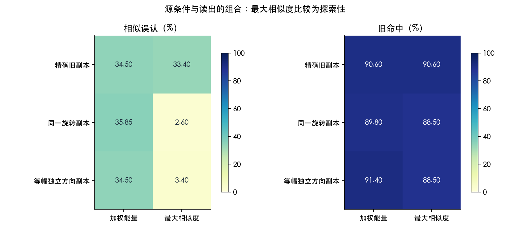

# Memory Replay Lab

[中文说明](README.zh-CN.md) · [Results and limits](RESULTS.md) · [Prior work](REFERENCES.md)

A CPU research toolkit for examining **replay selection, recognition readouts, and replay-source geometry** in a closed-form modern Hopfield memory. It separates partial-cue identity recovery from false recognition of similar unseen inputs, keeps replay budgets matched, and freezes recognition thresholds using calibration seeds before evaluating separate confirmation seeds.

The useful contribution is a small, auditable diagnostic experiment suite, including negative results. The memory equation and energy-guided replay idea come from prior work. This repository does **not** establish a new human memory mechanism, global novelty, or a superior practical memory system.

## Main observation

Changing exact replay copies to equally displaced independent directions did not reduce false recognition under the primary weighted-energy readout: both conditions produced **34.50%** similar-input false alarms. The prescribed joint improvement criterion failed. A maximum-similarity readout with displaced sources produced fewer false alarms, but also fewer old-target hits; this comparison is exploratory. Partial-cue identity recovery remains about **4.5%**.



## Quick start

Python 3.12 is the locally validated runtime. Install in a virtual environment:

```sh
python3 -m venv .venv
source .venv/bin/activate
python -m pip install -r requirements.txt
python -m pytest -q
python demo.py
```

The demo runs one synthetic seed and prints source/readout diagnostics. It is a smoke example, **not** a replacement for the confirmation study.

For the exact package versions used for the stored results, use `requirements-reproduction.txt`. The broader ranges in `requirements.txt` are for portability; installing another version does not promise bitwise reproduction. Only the current macOS/Python 3.12 environment was locally validated at release preparation. The included CI checks should be read from their actual run status.

## Full experiments

```sh
python run_energy.py       # stage 7: paper equation replication + replay selection
python run_readout.py      # stage 8: fixed-memory readout comparison
python run_fidelity.py     # stage 9: replay-source controls
```

Each entry point is independent: stages 8 and 9 use the shared model implementation, not the generated output of an earlier run. Stages 8 and 9 each use 20 calibration and 40 confirmation seeds. Stage 7 additionally evaluates nine size/correlation conditions and 2,000 paper-replication rotations. Full runs are larger than the demo and require minutes and disk space for query tables and caches; no GPU or human dataset is required.

Generated results go to `outputs/{energy,readout,fidelity}/`; raw case caches go to `work/`. To continue an interrupted or already frozen run:

```sh
python run_fidelity.py --resume
python run_readout.py --resume
python run_energy.py --resume
```

The cache checks source, protocol and configuration fingerprints; stages 8/9 also check raw NPZ hashes. A changed source or protocol requires a fresh working copy for a new experiment. Do not reuse frozen thresholds from another configuration. Reports and figures are generated in Chinese. On systems without a Chinese font, computation still works, but plot labels may require installing a CJK font and adjusting Matplotlib's font selection.

## What is included

- `src/energy.py`: explicit-vector memory, energy, recall, synthetic fixtures and matched replay schedules.
- `src/readout.py`: weighted energy, equal-mass energy, reconstruction and maximum-similarity readouts on fixed memories.
- `src/fidelity.py`: exact, common-rotation and angle-matched independent-direction replay sources.
- `*_protocol.md`: original local protocols recorded before the corresponding runs; **not public preregistrations**.
- `reference_results/`: original result snapshots, seed-level tables, intervals, frozen calibration thresholds and figures. These are separate from new generated outputs.
- `outputs/literature/`: dated literature-search snapshots, including what was actually read and the limits of the novelty search.
- `tests/`: 20 scientific/engineering checks for gradients, identities, budgets, read-only recognition, calibration isolation and cache integrity.

The public subset covers stages 7–9 of a larger local study. Earlier human-data analyses, raw human data, machine paths and intermediate archives are not part of this release. Model/protocol files are preserved unchanged; the public packaging adds documentation, dependencies, a demo and CI.

## Interpretation

Replay is represented as extra explicit support vectors and probability mass, not synaptic updates, STDP or neural-network training. No-replay stores fewer vectors and has a lower budget, so it is a reference rather than a budget-matched competitor. Common-rotation sources duplicate existing support points; independent directions change correlations. These are declared geometry controls, not pure fidelity interventions. Seed-level bootstrap intervals are approximate and adjusted for the prespecified families; a failed test does not prove equivalence.

See [RESULTS.md](RESULTS.md) for the numerical comparisons and limitations, and [REFERENCES.md](REFERENCES.md) for attribution. Code, project documentation and original synthetic result artifacts are released under the [MIT License](LICENSE); third-party papers and linked repositories retain their own licenses.

## Cite and contribute

Use [CITATION.cff](CITATION.cff) to cite this research software, and cite the original papers for the model and prior methods. See [CONTRIBUTING.md](CONTRIBUTING.md). Any proposed new research direction should first check relevant prior work and explain the additional question it answers.
